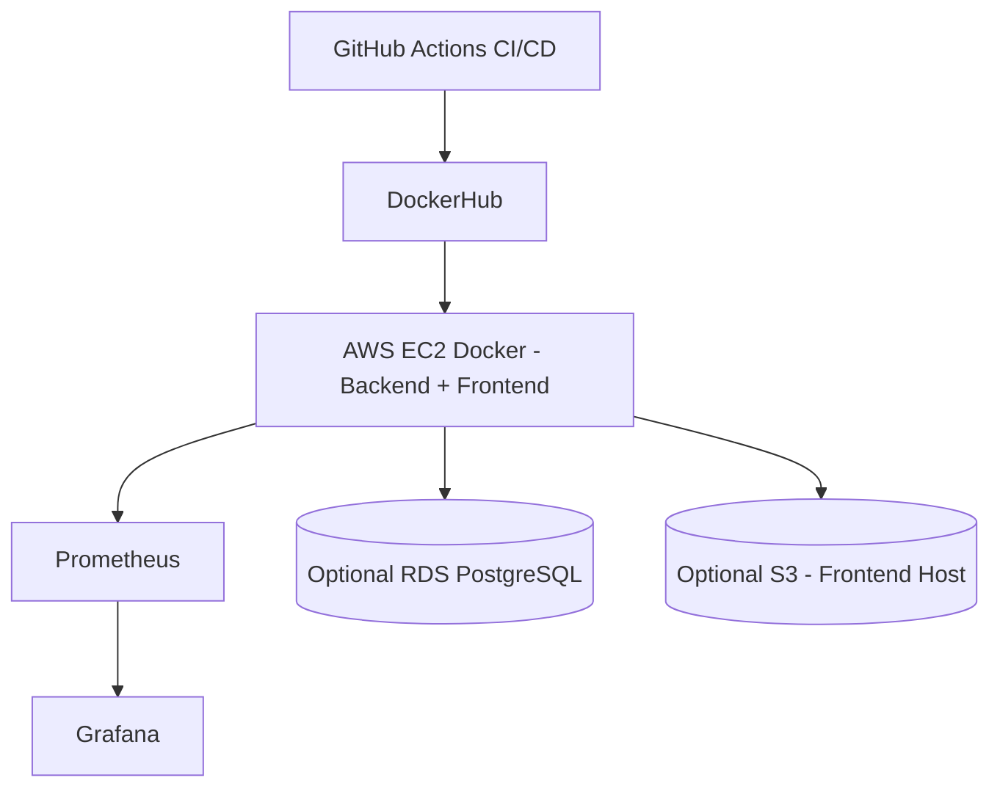

# 🏗️ cloudops-infra

Infrastructure for the CloudOps Portfolio. Includes Terraform IaC for a simple VPC, EC2 instance (dockerized), optional S3 bucket and optional RDS Postgres. Also includes a monitoring stack (Prometheus + Grafana).

---

## 📂 Repository Structure: `cloudops-infra`

- 📁 **terraform/**
  - 📄 main.tf
  - 📄 variables.tf
  - 📄 outputs.tf
  - 📄 ec2_user_data.sh

- 📁 **monitoring/**
  - 📄 docker-compose-monitoring.yml
  - 📄 prometheus.yml

- 📁 **diagrams/**
  - 📄 infra-diagram.mmd


---

## Quick start (assumes AWS credentials configured locally)

1. Edit `terraform/variables.tf` defaults if needed or create a `terraform/terraform.tfvars` file (example below).
2. Initialize Terraform:
```bash
cd terraform
terraform init
terraform plan -out plan.tfplan
terraform apply "plan.tfplan"
terraform output
```
---

## Docker
```
cd monitoring
docker-compose -f docker-compose-monitoring.yml up -d
```
---

- Edit prometheus.yml and replace BACKEND_HOST with your EC2 IP if needed

---

## Cleanup (cost control)

### To remove all resources:
```
cd terraform
terraform destroy -auto-approve
```

WARNING: If you created RDS or S3, you'll be billed until destroyed. Always run terraform destroy after testing.

---
